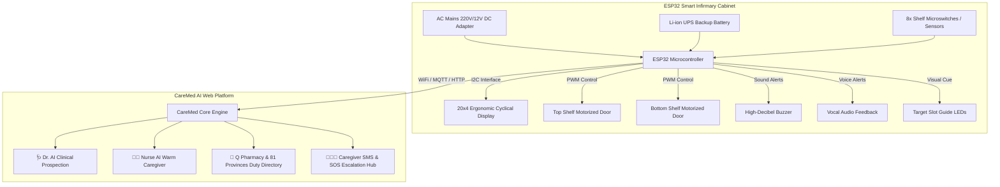

# 💊 CareMed AI & Smart Physical Medicine Cabinet

> **An Autonomous, Intergenerational MedTech Ecosystem: Hardware-Locked Smart Infirmary Cabinet (ESP32) + AI Health Companion & Duty Pharmacy Routing Platform.**

---

## 📌 Author's Statement: 100% Independent & AI-Assisted Engineering

> [!NOTE]
> ### 👤 Independent Creator Note
> **This project was designed, architected, coded, and engineered completely independently by the author, built from scratch as a solo initiative without any academic institution, university faculty, laboratory, or external human assistance.**
> 
> *The author did not attend a prestigious technical institute like MIT, and the university program attended provided no curriculum or resources related to this engineering domain. Instead of relying on formal academic credentials or institutional support, this entire MedTech ecosystem was conceived and developed through self-directed study, autonomous problem-solving, and advanced pair-programming with Artificial Intelligence (AI). It stands as proof that groundbreaking engineering and real-world innovation stem from personal grit, passion, and modern AI synergy.*

---

## 🌟 Executive Summary & Problem Statement

Standard "Medication Reminder" mobile apps fail elderly users. Studies show that over **70% of seniors aged 65+** suffer from vision impairment (cataracts, macular degeneration), cognitive decline, memory lapse, or tremors (Parkinson's disease). Expecting an elderly person to type into small touchscreens or remember which pill is in which drawer leads to life-threatening mistakes (double-dosing, taking the wrong pill, or missing critical chronic doses).

**CareMed AI** solves this with a **two-pronged ecosystem**:
1. **Physical Smart Cabinet (Hardware / IoT):** An 8-slot, dual-tier physical cabinet that physically locks medications, unlocks only the required door when due, guides the senior with visual LEDs, and detects if a pill box is returned to the wrong slot using camera/sensor verification and live vocal warnings.
2. **CareMed Web Platform (Digital Hub):** A comprehensive companion web platform featuring dual AI personas (clinical Dr. AI vs empathetic Nurse AI), nationwide duty pharmacy network routing across all 81 provinces of Turkey, multi-tier search, prescription management, and real-time caregiver escalation logs.

---

## 🏗️ System Architecture



---

## 🚪 Part 1: Physical Smart Infirmary Cabinet (Hardware)

The physical cabinet is modeled after a medical infirmary cabinet with a central horizontal divider creating **two tiers (Top Shelf & Bottom Shelf)** with **8 dedicated slots**:
* **Top Shelf:** Slots 1, 2, 3, 4 (e.g., Slot 1: Coraspin 100mg, Slot 2: Glucophage 850mg, Slot 3: Beloc ZOK 50mg, Slot 4: Parol 500mg).
* **Bottom Shelf:** Slots 5, 6, 7, 8 (e.g., Slot 5: Nexium 40mg, Slot 6: Lipitor 20mg, Slot 7: Augmentin 1000mg, Slot 8: Ecopirin 150mg).

### 1. Dual Independent Motorized Doors
* When a dose is due on the **Top Shelf**, only the top door unlocks and swings open (90°).
* When a dose is due on the **Bottom Shelf**, only the bottom door opens.
* If medications are scheduled across both shelves, **both doors open simultaneously**.
* Closed doors remain physically locked, preventing confusion or accidental double-dosing.

### 2. Ergonomic Non-Touch Cyclical Display
Touchscreens cause frustration for elderly individuals with tremors or low dexterity. CareMed features a high-contrast **20x4 character non-touch display** that cycles through essential information every 3.5 seconds:
* **Screen 1 (Date & Time):** Current live clock, date, and AC power status.
* **Screen 2 (Daily Progress):** *"Taken Today: 2 doses | Remaining: 1 dose"*.
* **Screen 3 (Next Upcoming Dose):** *"Next: Coraspin 100mg (18:00 Evening)"*.
* **Screen 4 (Hydration & Health Tip):** *"Drink plenty of warm water! Remain upright for 15 mins."*

### 3. Action Ingestion Cycle: "Lifted -> Ingested -> Returned"
1. **Dose Alarm:** Buzzer sounds *"Beep-Beep"*, voice prompt plays (*"Dose time! Please take your Coraspin 100mg"*), door opens, and the target slot's green LED illuminates.
2. **Medicine Lifted:** Microswitch detects the box has been removed from the shelf. Screen transitions to: *"MEDICINE TAKEN! Ingest with water..."*
3. **Return & Slot Verification:**
   * **Correct Slot:** When returned to the assigned slot, the system emits an affirmative chime, updates stock counts, closes the motorized door, and dispatches a caregiver SMS (*"Medication ingested and cabinet secured."*).
   * **Wrong Slot (Camera / Sensor Misplacement Detection):** If the user places the box into an incorrect slot, a harsh error tone fires and the speaker announces:
     > *"WARNING! Coraspin belongs in Top Shelf Slot #1! Why is it placed in Top Shelf Slot #3 where Beloc ZOK belongs? Please return to the correct slot!"*

### 4. Q Pharmacy Low-Stock Notification
When a medication's remaining count drops to **3 pills or fewer**, the top display and serial notification automatically broadcast:
> *"⚠️ [Q PHARMACY REFILL ALERT]: Coraspin is running low! Please visit your original dispensary 'Q Pharmacy' (or nearest duty pharmacy) to replenish your prescription."*

### 5. Continuous AC Mains Power with UPS Backup
Unlike battery-only gadgets that require daily recharging (which seniors inevitably forget), CareMed connects directly to a **12V DC wall adapter** (like a refrigerator or microwave). An internal **18650 Li-ion battery backup** ensures uninterrupted 24-hour operation during power outages.

---

## 🌐 Part 2: CareMed AI Web Platform & Companion App

The web platform ([`index.html`](file:///c:/Users/LENOVO/Documents/wolwerine/index.html), [`styles.css`](file:///c:/Users/LENOVO/Documents/wolwerine/styles.css), [`app.js`](file:///c:/Users/LENOVO/Documents/wolwerine/app.js)) complements the physical hardware:

### ✨ Key Software Features
1. **Dual AI Personas:**
   * **🩺 Dr. AI:** Clinical, evidence-based pharmacology, drug interactions, contraindications, and emergency 112 escalation.
   * **👩‍⚕️ Nurse AI:** Warm, encouraging, conversational daily care (*"Ahmet Uncle, eat a good breakfast, swallow your pill with warm water, and don't lie down for 15 minutes, okay?"*).
2. **Global & Turkish Medication Catalog (60+ Drugs):**
   * Built-in instant search by brand name or active pharmaceutical ingredient (*Paracetamol, Metformin, Atorvastatin, Metoprolol, Levothyroxine, etc.*) with 1-click addition to patient schedules.
3. **Nationwide Duty Pharmacy Search (All 81 Provinces):**
   * Multi-tier filtering across all 81 provinces of Turkey, districts, neighborhoods, and free-text queries (e.g., *"Ankara Mamak"* or *"Kadıköy Moda"*).
4. **Voice-First Engine & Gender Voice Pitching:**
   * Uses Web Speech API for voice command recognition.
   * Adapts pitch and system voice synthesis based on patient gender (Female voice for female patients, Male voice for male patients) with phonetic corrections for foreign drug names.
5. **Dark & Light Mode + Multilingual (TR / EN):**
   * Instant toggle between Dark Theme and Light Theme.
   * Full i18n support switching the UI and speech engine between Turkish and English.
6. **Caregiver Oversight (Max 2 Caregivers):**
   * Tracks adherence percentage, missing dose alerts, and SMS delivery logs. Automatically purges stale references when patient profiles are deleted.
7. **Security & E-Devlet Integration:**
   * 11-digit T.C. Kimlik authentication and E-Devlet / E-Nabız data sync simulation with Two-Factor Authentication (2FA) SMS toggle.

---

## ⚡ Quick Start: Running the Hardware Simulation on Wokwi

The entire physical cabinet firmware is provided in the [`firmware/`](firmware/) folder. It is designed to run in Wokwi without consuming heavy CPU resources:

1. Open your browser and navigate to **[Wokwi ESP32 Simulator](https://wokwi.com)**.
2. Replace `diagram.json` with the contents of [`firmware/diagram.json`](firmware/diagram.json).
3. Replace `sketch.ino` with [`firmware/sketch.ino`](firmware/sketch.ino).
4. In the **Libraries** tab, add:
   ```text
   LiquidCrystal I2C
   ESP32Servo
   ```
5. Click the green **Play** button!
   * The top door servo will open to 90°, the green LED will illuminate, and the 20x4 LCD will prompt: `! MEDICATION TIME !`.
   * Click **Top-1** button to simulate lifting the pill box from the shelf.
   * Click **Top-3** button to simulate placing it into the wrong slot and hear the vocal misplacement alarm.
   * Click **Top-1** button again to return it properly, observe the confirmation chime, and see the door close and lock automatically!

---

## 💻 Quick Start: Running the Web Platform

No external server or build step required. The application runs natively in any modern web browser:

1. Clone or download this repository.
2. Open [`index.html`](index.html) in Google Chrome, Microsoft Edge, or Mozilla Firefox.
3. Alternatively, launch a lightweight local server:
   ```bash
   python -m http.server 8080
   ```
4. Access `http://localhost:8080` to experience the full interactive platform!

---

## 📂 Repository Structure

```text
├── index.html            # Main web platform markup (Senior Mode & Caregiver Dashboard)
├── styles.css            # Responsive CSS design system (Dark/Light themes, high contrast)
├── app.js                # Core JS logic, AI personas, 81 cities pharmacy engine, i18n
├── .gitignore            # Clean git exclusion rules
├── README.md             # Complete project pitch, hardware documentation, and author note
└── firmware/             # Physical Smart Cabinet IoT Package
    ├── sketch.ino        # ESP32 C++ firmware (servos, sensors, state machine, LCD)
    ├── diagram.json      # Wokwi wiring and components configuration
    └── libraries.txt     # Embedded libraries for Wokwi simulation
```

---

## 📜 License & Acknowledgments

* **Author:** Independent Maker / Autonomous AI Pair-Programming Project.
* **License:** MIT License — Open for research, humanitarian eldercare initiatives, and educational hardware prototypes.
